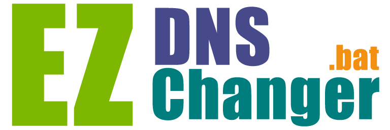
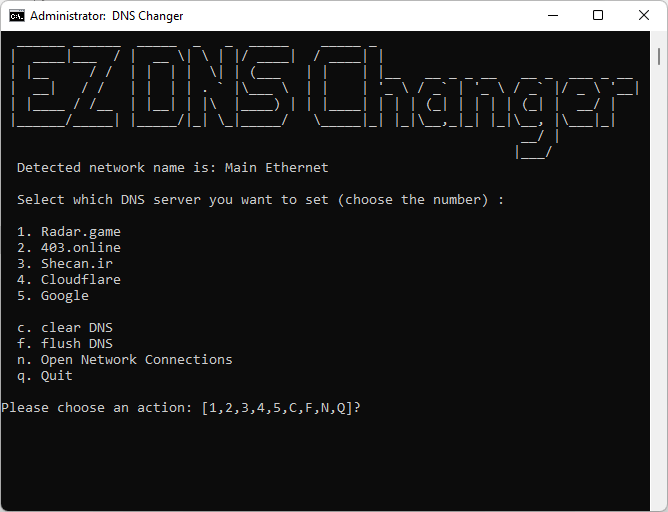

  <h3>EZ DNS Changer</h3>
  
تغییر دی ان اس آسان

 

<!-- About the Project -->

## :star2: درباره

با توجه به شرایط فعلی یافتن دی ان اس مناسب و تغییر مداوم آن تبدیل به یکی از دغدغه های برنامه نویسان، گیمر ها و دیگر کاربران حرفه ای کشورمان شده است.

**هدف این ریپو تهیه یک فایل جامع، ساده و کاملا شفاف برای تغییر دی ان اس میباشد**

لطفا توجه داشته باشید که این سرویس، فیلتر شکن نیست و یک سرویس رفع تحریم است، به صورتی که بسیاری از سرویس های بازی و برنامه نویسی که با اینترنت ایران در دسترس نیستند را برای شما در دسترس قرار میدهد.
برای اطلاعات بیشتر و مشاهده بازی ها و سرویس های رفع فیلتر شده میتوانید به وبسایت دی ان اس ها مراجه کنید

[وبسایت دی ان اس ها](## :gem: Acknowledgements)

<!-- Usage -->

## :eyes: نحوه استفاده

برای استفاده شما به دو فایل `ez-dns-changer.bat` و `dns-servers.txt` نیاز دارید.

تنها کافی است فایل `ez-dns-changer.bat` را در ویندوز باز کنید و شماره سرور مورد نظر خود را انتخاب کنید!

شما همچنین میتوانید لیست سرور های موجود را در فایل `dns-servers.txt` مشاهده و ویرایش کنید.

<!-- Default Servers -->

## :white_check_mark: Default Servers

* [x] 1. Radar.game (بازی)
* [x] 2. 403.online (برنامه نویسی)
* [x] 3. Shecan.ir (برنامه نویسی)
* [x] 4. Cloudflare
* [x] 5. Google

<!-- Roadmap -->

## :compass: TODO / Roadmap

* [x] 1. change dns with bat file
* [x] 2. read dns servers from a config file
* [x] 3. flush dns
* [x] 4. clear dns
* [ ] 5. add the ability to ping a certain ip (input) with all of the dns servers and report the results.

<!-- Known Issues -->

## :warning: Known Issues

* اگر سیستم همزمان به چند شبکه اینترنت متصل باشد، ممکن است نتورک اشتباهی شناسایی شود
* بیش از 9 سرور نمیتواند در لیست سرور ها تعریف شود

<!-- Contributing -->

## :wave: Contributing

Contributions are always welcome!

<!-- Contact -->

## :handshake: Contact
sm.mirbehbahani@gmail.com

<!-- Acknowledgments -->

## :gem: Acknowledgements
- [Shecan.ir](https://shecan.ir/)
- [Radar.game](https://radar.game/)
- [403.online](https://403.online/)
